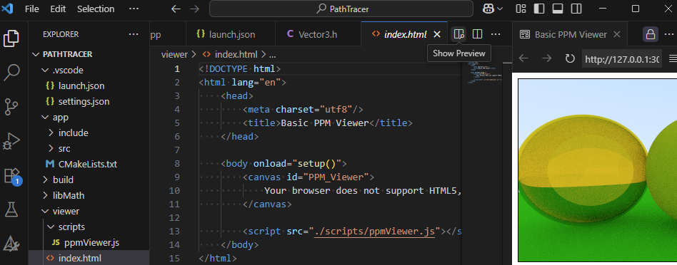

# VS Code Ray Tracer

This repository is the initial set up for getting started in writing a ray traer using VS Code as a development environment with C++ as the programming language.

The compilation process uses CMake as a build system, so there are a couple of additional plugins for VS code that are required. 
You'll need to have the following VS Code plugins:
 - [C/C++ Tools](https://marketplace.visualstudio.com/items?itemName=ms-vscode.cpptools)
 - [C/C++ Extension Pack](https://marketplace.visualstudio.com/items?itemName=ms-vscode.cpptools-extension-pack)
 - [CMake Tools](https://marketplace.visualstudio.com/items?itemName=ms-vscode.cmake-tools)
 - [Live Preview](https://marketplace.visualstudio.com/items?itemName=ms-vscode.live-server)

## Installing CMake

Head over to the [CMake Downloads page](https://cmake.org/download/) and install the latest version of CMake. 

## Installing a C/C++ compiler

Unfortunately installing the C/C++ Tools for VS code may not be enough to jump straight into development, as you may need to install a C++ compiler. If you already have Visual Studio installed on your PC then chances are you already have a C++ compiler, however if you don't you will need to head over to the [Configure VS Code for MS C++](https://code.visualstudio.com/docs/cpp/config-msvc) page and follow the instructions at **step 3** to install the MSVC compiler.
After installing the MSVC compiler you may need to close and re-open VS Code so that any environment variables that might be required are picekd up in the VS Code terminal.

## Why Live Preview

Well this ray tracer will produce a PPM image when run, and having to make use of a separate application to view the content of that image is a bit cumbersome in my opinion. Which is why I wrote a small javascript routine to load the PPM image into a HTML5 canvas element. 

The [index.html](/viewer/index.html) page can be viewed with **"Show Preview"** button at the top of the screen to show the output.ppm file as shown in the following screenshot.

Or by right clicking on the *index.html* file in the Explorer window and selecting *Show priview*.

## Building the code

Once you have all of the dependencies and VS Code Extensions installed it should just be a case of pressing **Ctrl+Shift+P** to bring up the VS Code command window and search for "CMake: Configure" run the configuration step.

The first time you run CMake Configure you will need to select a compiler, if you're totally new to this you want probably want to choose the MSVC 64 bit compiler from the list. 

Then press **Ctrl+Shift+P** again and run *Cmake: Build* to build the application and math library.

Then press **F5** to run the executable (there's a VS Code Launch.json file in the project that has a launch option configured for Windows - if you're not on Windows you'll need to modify things a little bit).

